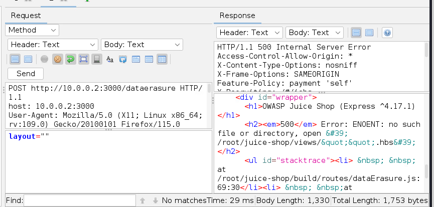

# Отчет

## Web App

Просканируем при помощи ZAP веб приложение

отчет сканирования

[2024-08-04-ZAP-Report-.html](2024-08-04-ZAP-Report-.html)

Эксплуатация уязвимостей:

- SQL Injection
    - Залогинится админом
        
        как видно из отчета есть возможность для sql инъекции при логине. Используя стандартную инъекцию “‘ or 1=1” из отчета в качестве ответа получаем пустого пользователя, следовательно немного модифицируем запрос “’ or 1=1 —”и получим успешную авторизацию в качестве администратора и логин для его учетной записи.
        
        
        
    - Заказать продукт который был удален
        
        Как видно из отчета существует возможность в параметр q при поиске. Следовательно попробуем произвести инъекцию “”  —” в результате которой получим сообщение о неверном синтаксисе sql. Следовательно не хватает закрывающих скобок. В результате перебором добавляем две скобки и с помощью инъекции “’))  —” получаем список всех возможных товаров и находим что id удаленного товара 10. Регистрируемся под пользователем и с помощью модифицированного post запроса добавляем его к себе в корзину.
        
        
        
        
        
        
        
    - Получить схему базы данных
        
        на основе результатов эксплуатации предыдущей уязвимости мы знаем количество столбцов в базе данных следовательно можем использовать атаку UNION SELECT чтобы вставить данные из таблицы sqlite_master в таблицу с выдачей нашего поиска. Соответственно при помощи внедрения SQL инъекции “qwert')) UNION SELECT sql, '2', '3', '4', '5', '6', '7', '8', '9' FROM sqlite_master—” в тело параметра q получаем в качестве ответа от сервера искомую информацию.
        
        
        
- XSS
    - Выполнить атаку и пройти механизм безопасности клиента
        
        Необходимо послать POST запрос авторизации пользователя с данными параметрами: email: `<iframe src=\"javascript:alert(`xss`)\"> а в качестве пароля любое сочетание символов
        
        
        
        В результате при выполнения входа на панель администрирования со списком всех пользователей у администратора высветится окно с ошибкой
        
        
        
- LFR
    
    В результате анализа страниц было выявлено что в процессе удаления посылается post запрос с данными параметрами: email и security answer. При запуске программы fuzer для этих параметров по словарю была обнаружена ошибка 500 в теле которой содержалась информация “No such file or directory”
    
    
    
    это дает нам информацию о возможности LFR атаки. Подобрав нужное имя файла из стандартных получаем доступ к файлу package.json
    
    
    

## Windows

[https://medium.com/@kushalshrestha77/pentesting-metasploitable-3-windows-machine-aa824460947e](https://medium.com/@kushalshrestha77/pentesting-metasploitable-3-windows-machine-aa824460947e)

[https://era.library.ualberta.ca/items/ada5c209-9f7c-4406-bddb-656821859523/view/2ba00c1e-f7a2-4d86-8cb8-c1d70e62cdc2/Sharma_2020_Fall_MISSM.pdf](https://era.library.ualberta.ca/items/ada5c209-9f7c-4406-bddb-656821859523/view/2ba00c1e-f7a2-4d86-8cb8-c1d70e62cdc2/Sharma_2020_Fall_MISSM.pdf)

## **GlassFish**

**Ports**

- 4848 - HTTP
- 8080 - HTTP
- 8181 - HTTPS

**Credentials**

- Username: admin
- Password: sploit

**Access**

- On Metasploitable3, point your browser to [http://localhost:4848](http://localhost:4848/).
- Login with the above credentials.

**Start/Stop**

- Stop: Open task manager and kill the java.exe process running glassfish
- Start: Go to Task Scheduler and find the corresponding task. Right-click and select Run.

**Vulnerability IDs**

- CVE-2011-0807

**Modules**

- exploits/multi/http/glassfish_deployer
- auxiliary/scanner/http/glassfish_login

## **chinese caidao**

**Ports**

- 80 - HTTP

**Credentials**

- Any credentials valid for Metasploitable3 should work. See the list [here](https://github.com/rapid7/metasploitable3/wiki/Configuration#credentials)

**Access**

- Point your browser on metasploitable3 to [http://localhost/caidao.asp](http://localhost/caidao.asp)

**Start/Stop**

- Stop: Open services.msc. Stop the World Wide Web Publishing service.
- Start: Open services.msc. Start the World Wide Web Publishing service.

**Modules**

- auxiliary/scanner/http/caidao_bruteforce_login

## **Apache Struts**

**Ports**

- 8282 - HTTP

**Credentials**

- Apache Tomcat Web Application Manager
    - U: sploit
    - P: sploit

**Access**

- To access the vulnerable application, point your browser on Metasploitable3 to [http://localhost:8282/struts2-rest-showcase](http://localhost:8282/struts2-rest-showcase)
- To access the Apache Tomcat Manager, point your browser on Metasploitable3 to [http://localhost:8282](http://localhost:8282/). Login with the above credentials.

**Start/Stop**

- Stop: Open services.msc. Stop the Apache Tomcat 8.0 Tomcat8 service.
- Start: Open services.msc. Start the Apache Tomcat 8.0 Tomcat8 service.

**Vulnerability IDs**

- CVE-2016-3087

**Modules**

- exploit/multi/http/struts_dmi_rest_exec

## **Jenkins**

**Ports**

- 8484 - HTTP

**Credentials**

- None enabled by default

**Access**

- Point your browser on Metasploitable3 to [http://localhost:8484](http://localhost:8484/).

**Start/Stop**

- Stop: Open services.msc. Stop the jenkins service.
- Start: Open services.msc. Start the jenkins service.

**Modules**

- exploits/multi/http/jenkins_script_console
- auxiliary/scanner/http/jenkins_enum

## **Tomcat**

**Ports**

- 8282 - HTTP

**Credentials**

- U: sploit
- P: sploit

**Access**

- To access the Apache Tomcat Manager, point your browser on Metasploitable3 to [http://localhost:8282](http://localhost:8282/). Login with the above credentials.

**Start/Stop**

- Stop: Open services.msc. Stop the Apache Tomcat 8.0 Tomcat8 service.
- Start: Open services.msc. Start the Apache Tomcat 8.0 Tomcat8 service.

**Vulnerability IDs**

- CVE-2009-3843
- CVE-2009-4189

**Modules**

- auxiliary/scanner/http/tomcat_enum
- auxiliary/scanner/http/tomcat_mgr_login
- exploits/multi/http/tomcat_mgr_deploy
- exploits/multi/http/tomcat_mgr_upload
- post/windows/gather/enum_tomcat

## **IIS - HTTP**

**Ports**

- 80 - HTTP

**Credentials**

- U: vagrant
- P: vagrant

**Access**

- Point your browser on Metasploitable3 to [http://localhost](http://localhost/).

**Start/Stop**

- Stop: Open services.msc. Stop the World Wide Web Publishing service.
- Start: Open services.msc. Start the World Wide Web Publishing service.

**Vulnerability IDs**

- CVE-2015-1635

**Modules**

- auxiliary/dos/http/ms15_034_ulonglongadd

## **IIS - FTP**

**Ports**

- 21 - FTP

**Credentials**

Windows credentials

**Access**

Any FTP client should work

**Start/Stop**

- Stop: `net stop msftpsvc`
- Start: `net start msftpsvc`

**Modules**

- auxiliary/scanner/ftp/ftp_login

## **psexec**

**Ports**

- 445 - SMB
- 139 - NetBIOS

**Credentials**

- Any credentials valid for Metasploitable3 should work. See the list [here](https://github.com/rapid7/metasploitable3/wiki/Configuration#credentials)

**Access**

- Use the [psexec tool](https://technet.microsoft.com/en-us/sysinternals/pxexec.aspx) to run commands remotely on the target.

**Start/Stop**

- Enabled by default

**Vulnerabilities**

- Multiple users with weak passwords exist on the target. Those passwords can be easily cracked and used to run remote code using psexec.

**Modules**

- exploits/windows/smb/psexec
- exploits/windows/smb/psexec_psh

## **PHPMyAdmin**

**Ports**

8585 - HTTP

**Credentials**

U: root P:

**Access**

On Metasploitable3, point your browser to [http://localhost:8585/phpmyadmin](http://localhost:8585/phpmyadmin).

**Start/Stop**

- Stop: In command prompt, do `net stop wampapache`
- Start: In command prompt, do `net start wampapache`

**Vulnerability IDs**

- CVE-2013-3238

**Modules**

- multi/http/phpmyadmin_preg_replace

## **Ruby on Rails**

**Ports**

- 3000- HTTP

**Credentials**

N/A

**Access**

- On Metasploitable3, point your browser to [http://localhost:3000](http://localhost:3000/).

**Start/Stop**

- Stop: Open task manager and kill the ruby.exe process
- Start: Go to Task Scheduler and find the corresponding task. Right-click and select Run.

**Vulnerability IDs**

- CVE-2015-3224

**Modules**

- exploit/multi/http/rails_web_console_v2_code_exec

## **Remote Desktop**

**Ports**

3389 - RDP

**Credentials**

Any Windows credentials

**Access**

Use a remote desktop client. Either your OS already has one, or download a 3rd party.

**Start/Stop**

- Stop: `net stop rdesktop`
- Start: `net start rdesktop`

**Modules**

N/A

## **Wordpress**

**Ports**

8585 - HTTP

**Credentials**

No credentials needed

**Access**

On Metasploitable3, point your browser to [http://localhost:8585/wordpress](http://localhost:8585/wordpress).

**Start/Stop**

- Stop: In command prompt, do `net stop wampapache`
- Start: In command prompt, do `net start wampapache`

**Vulnerable Plugins**

- NinjaForms 2.9.42 - CVE-2016-1209

**Modules**

- unix/webapp/wp_ninja_forms_unauthenticated_file_upload

## **JMX**

**Ports**

1617 - TCP

**Credentials**

No credentials needed

**Access**

Download the connector client and use the instructions found here: [http://docs.oracle.com/javase/tutorial/jmx/remote/index.html](http://docs.oracle.com/javase/tutorial/jmx/remote/index.html)

**Start/Stop**

- Stop: In command prompt, do `net stop jmx`
- Start: In command prompt, do `net start jmx`

**Vulnerability IDs**

- CVE-2015-2342

**Modules**

- multi/misc/java_jmx_server

## **MySQL**

**Ports**

3306 - TCP

**Credentials**

U: root P:

**Access**

Use the mysql client to connect to port 3306 on Metasploitable3.

**Start/Stop**

- Stop: In command prompt, do `net stop wampmysql`
- Start: In command prompt, do `net start wampmysql`

**Modules**

- windows/mysql/mysql_payload

## **SNMP**

**Ports**

161 - UDP

**Credentials**

Community String: public

**Access**

Load the auxiliary/scanner/snmp/snmp_enum module in Metasploit and to parse the SNMP data.

**Start/Stop**

- Stop: In command prompt, do `net stop snmp`
- Start: In command prompt, do `net start snmp`

**Modules**

- auxiliary/scanner/snmp/snmp_enum

## **WebDAV**

**Ports**

8585 - HTTP

**Credentials**

No credentials needed

**Access**

See the PR here: [https://github.com/rapid7/metasploitable3/pull/16](https://github.com/rapid7/metasploitable3/pull/16)

**Start/Stop**

- Stop: In command prompt, do `net stop wampapache`
- Start: In command prompt, do `net start wampapache`

**Modules**

- auxiliary/scanner/http/http_put (see [https://github.com/rapid7/metasploitable3/pull/16](https://github.com/rapid7/metasploitable3/pull/16))

## **Apache Axis2**

**Ports**

8282 - HTTP

**Credentials**

No credentials needed

**Access**

On Metasploitable3, point your browser to [http://localhost:8282/axis2](http://localhost:8282/axis2).

**Start/Stop**

Log into Apache Tomcat, and start or stop from the application manager.

**Vulnerability IDs**

- CVE-2010-0219

**Modules**

- exploit/multi/http/axis2_deployer

## **ElasticSearch**

**Ports**

9200 - HTTP

**Credentials**

No credentials needed

**Access**

On Metasploitable3, point your browser to [http://localhost:9200](http://localhost:9200/).

**Start/Stop**

- Stop: In command prompt, do `net stop elasticsearch-service-x64`
- Start: In command prompt, do `net start elasticsearch-service-x64`

**Vulnerability IDs**

- CVE-2014-3120

**Modules**

- exploit/multi/elasticsearch/script_mvel_rce

## **ManageEngine**

**Ports**

8020 - HTTP

**Credentials**

Username: admin Password: admin

**Access**

On Metasploitable3, point your browser to [http://localhost:8020](http://localhost:8020/). Login with the above credentials.

**Start/Stop**

- Stop: In command prompt, do `net stop ManageEngine Desktop Central Server`
- Start: In command prompt, do `net start ManageEngine Desktop Central Server`

**Vulnerability IDs**

- CVE-2015-8249

**Modules**

- exploit/windows/http/manageengine_connectionid_write

## **WinRM**

**Ports**

- 5985 - HTTPS

**Credentials**

- Any credentials valid for Metasploitable3 should work. See the list [here](https://github.com/rapid7/metasploitable3/wiki/Configuration#credentials)

**Access**

**Start/Stop**

- Stop: Open services.msc. Stop the Windows Remote Management service.
- Start: Open services.msc. Start the Windows Remote Management service.

**Vulnerabilities**

- Multiple users with weak passwords exist on the target. Those passwords can be easily cracked and WinRM can be used to run remote code on the target.

**Modules**

- auxiliary/scanner/winrm/winrm_cmd
- auxiliary/scanner/winrm/winrm_wql
- auxiliary/scanner/winrm/winrm_login
- auxiliary/scanner/winrm/winrm_auth_methods
- exploits/windows/winrm/winrm_script_exec

## **SSH**

**Ports**

- 22 - SSH

**Credentials**

- Any credentials valid for Metasploitable3 should work. See the list [here](https://github.com/rapid7/metasploitable3/wiki/Configuration#credentials)

**Access**

- Use an SSH client to connect and run commands remotely on the target.

**Start/Stop**

- Enabled by default

**Vulnerabilities**

- Multiple users with weak passwords exist on the target. Those passwords can be easily cracked. Once a session is opened, remote code can be executed using SSH.

**Modules**

## Active Directory