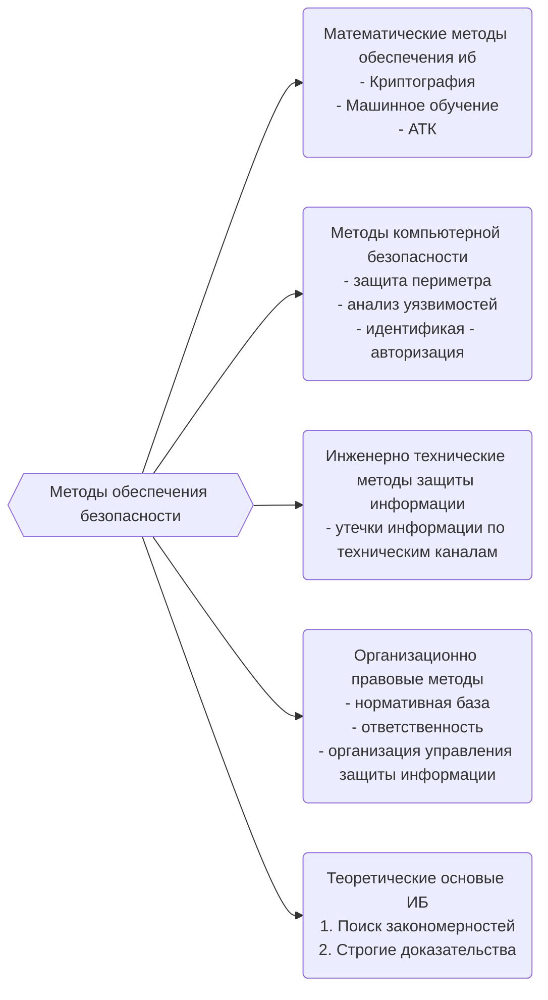

# Теоретические основые информационной безопасности автоматизированных систем

[[Схема.canvas|Схема]]
![[Pasted image 20240906232004.png]]

---

# Основные понятия

***Информация***
	*В философии:* свойства материальных объектов и процессов сохранять и порождать определенные состояния
	В кибернетике: основание устранения неопределенности
	В рамках курса: все что можно представить символами конечного алфавита
***Автоматизированная система***
	совокупность средств вычислительной техники, программного обеспечения, каналов связи, информации, персонала и пользователей.
***Информационная безопасность***
	свойство. под ибас принято понимать такое её состояние, при котором она способна противостоять дестабилизирующему воздействию внутренних и внешних факторов. Функционирование, и сам факт существавания системы не создает доп. угроз для внешней среды и элементов системы.
