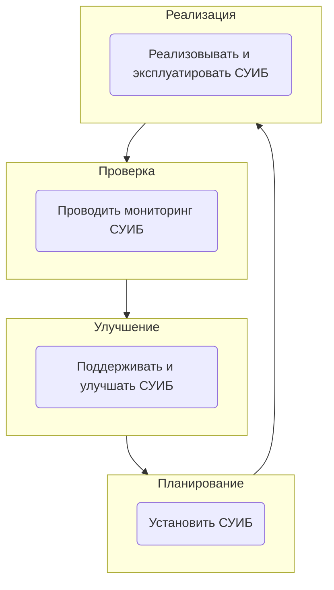

> [!Угроза]
> потенциальные (вероятностный характер) воздействия приносящие ущерб 

> [!important]
> Риск 
> количественная характеристика между угрозой и вероятностью. Насколько одна угроза опаснее другой измеряется в определенном риске. Грубо это вероятность умноженная на ущерб угрозы.

Справочник из 222 угроз составлен ФСТЕК. Для составления моделей угроз им необходимо пользоваться. 

> [!important] Уязвимость
> проблема (дефект) существование (эксплуатация) которой является угрозой. Уязвимость это подмножество угроз или конкретная важная угроза для системы.

Уязвимостей по ФСТЕКУ 60175. Их число увеличивается порядка 10к в год.
Реест уязвимостей поскольку существует софт позволяющей контролировать ситуацию с уязвимостями. Сканеры сравнивает определенные параметры систем с критериями уязвимостей из классификатора уязвимостей. Для сканеров используются CVE report .

>[!info] СVE – Common Vulnarabilities and Exposures

СVE это справочник с 240 830 уязвимостями. 

>[!important] Компьютерная атака
>Искуственная угроза

> [!info] CAPEC – *Common Attack Pattern Enumeration and Classification* – дерево классификации компьютерных атак. Справочник по сути атаки, проведению и другие доп сведения.

# Свойство безопасности представляется основными свойствам:
1. **Конфиденциальность** –  доступ (просмотр) к информации имеет только уполномоченное лицо
2. **Целостность** – Менять информацию может только тот кому разрешено
	 * Логическая целостность – изменение информации
	 * Физическая целостность – свойство информации быть непротиворечивой
3. **Доступность** – у уполномоченного лица есть доступ к информации

> [!important] Управление ИБ – скоординированные дейстивя с целью повышения/сохранения требуемого уровня ИБ

> [!info] CУИБ – *система управления информационной безопасности* – совокупность участников, правил, процедур, мер, используемых для обесеечения требуемого уровня ИБ организации

MIST 853 – стандарты 

Приказ №17 ФСТЕК контролирующий как защищать АС: Состав мер защиты информации и их базовые наботы для соответствующего класса защищенност и автоматированных систем управления. В нем приведены меры безопастиности для соответствующих классов АС.

Приказ №21(Нормы ИСПДН), №31(Критическая инфраструктура), аналогичны №17, но 17 ориентирован конкретно на государственные системы и не распространяется на коммерческие. 
# Управление рисками

Стандарт ISO 31010
![[IMG_2247.jpeg]]

### Матрица рисков для анализа и управления рисками

|            | Harm Severity | Harm Severity | Harm Severity | Harm Severity |
| :--------: | :-----------: | :-----------: | :-----------: | :-----------: |
| Likelihood |     Minor     |   Marginal    |   Critical    | Catastrophic  |
|  Certain   |     High      |     High      |   Very High   |   Very High   |
|   Likely   |    Medium     |     High      |     High      |   Very High   |
|  Possible  |      Low      |    Medium     |     High      |   Very High   |
|  Unlikely  |      Low      |    Medium     |    Medium     |     High      |
|    Rare    |      Low      |      Low      |    Medium     |    Medium     |
| Eliminated |  Eliminated   |  Eliminated   |  Eliminated   |  Eliminated   |
### Варианты обработки риска

1. Уменьшение риска – самостоятельно решать риск
2. Передача риска – 
	1. Поручение риска страховой компании
	2. Передать на аутсорс решение вопроса, пользование услугой 
4. Принятие риска – продолжение дейтельности с учетом сопутсвующего ущерба
5. Отказ от риска – сворачивание деятельности связанной с риском

### Экономическая эффективность как критерии выбора мер безопастности

$ROI = \frac{\Delta ALE}{AT}100\%$
$ROI$ – отдача от инвестиций
$\Delta ALE$ – ожидаемое снижение среднегодовых потерь
$AT$ – годовые затраты на внедрение и поддержку средств

Карта близости

# Домашнее задание 1

До конца октября
Моделирование угроза
![[Pasted image 20240907112018.png|200x400]]
Dataflow diagram 1 уровня

Метод Stride
Spoofing identity
Tampering with data
Repudiation
Information disclousure
Denial of service
Elevation of privelage

Оценка угроз по методу DREAD 

По шкалам 1-5

Damage potential
Reproducibility
Exploitabitily
Affected users
Discoverability

